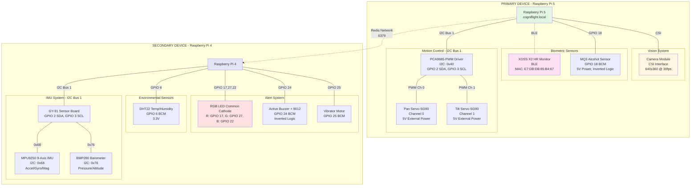

# CogniFlight Edge - Hardware Configuration

## System Hardware Diagram



## Hardware Components

| Component | Device | Interface | Connection Details | Description |
|-----------|--------|-----------|-------------------|-------------|
| **Camera Module** | Pi 5 | CSI | Dedicated camera connector | Raspberry Pi camera for vision processing at 640x360 @ 30fps |
| **XOSS X2 HR Monitor** | Pi 5 | BLE | MAC: E7:DB:DB:85:B4:67 | Bluetooth heart rate monitor with HRV analysis capability |
| **MQ3 Alcohol Sensor** | Pi 5 | GPIO | GPIO 18 (BCM), 5V power, inverted logic | Gas sensor for alcohol vapor detection with 30s warmup |
| **PCA9685 PWM Driver** | Pi 5 | I2C | Bus 1, Address 0x40, GPIO 2/3 | 16-channel PWM controller for servo motors |
| **Pan Servo (SG90)** | Pi 5 | PWM | PCA9685 Channel 0, 5V external | Horizontal camera tracking servo (10-170°) |
| **Tilt Servo (SG90)** | Pi 5 | PWM | PCA9685 Channel 1, 5V external | Vertical camera tracking servo (10-170°) |
| **RGB LED** | Pi 4 | GPIO | R: GPIO 17, G: GPIO 27, B: GPIO 22 | Common cathode RGB LED for status indication |
| **Active Buzzer** | Pi 4 | GPIO | GPIO 24 (BCM), inverted logic | HKD buzzer with 9012 PNP transistor (active-low) |
| **Vibrator Motor** | Pi 4 | GPIO | GPIO 25 (BCM) | Haptic feedback for alerts |
| **DHT22 Sensor** | Pi 4 | GPIO | GPIO 6 (BCM), 3.3V | Temperature and humidity sensor |
| **GY-91 Sensor Board** | Pi 4 | I2C | Bus 1, GPIO 2/3 | 10-DOF sensor board with MPU9250 + BMP280 |
| **MPU9250 IMU** | Pi 4 | I2C | Address 0x68 (on GY-91) | 9-axis IMU: accelerometer, gyroscope, magnetometer |
| **BMP280 Barometer** | Pi 4 | I2C | Address 0x76 (on GY-91) | Barometric pressure and altitude sensor |

## Pin Mapping Reference

### Primary Device (Pi 5)

| GPIO BCM | Function | Component | Notes |
|----------|----------|-----------|-------|
| GPIO 2 | I2C1 SDA | PCA9685 PWM Driver | Shared I2C bus |
| GPIO 3 | I2C1 SCL | PCA9685 PWM Driver | Shared I2C bus |
| GPIO 18 | Digital Input | MQ3 Alcohol Sensor | Inverted logic: HIGH=clean, LOW=detected |

### Secondary Device (Pi 4)

| GPIO BCM | Function | Component | Notes |
|----------|----------|-----------|-------|
| GPIO 2 | I2C1 SDA | GY-91 Sensor Board | Shared I2C bus |
| GPIO 3 | I2C1 SCL | GY-91 Sensor Board | Shared I2C bus |
| GPIO 6 | 1-Wire | DHT22 Temperature/Humidity | Digital sensor protocol |
| GPIO 17 | Digital Output | RGB LED Red Channel | 3.3V logic |
| GPIO 22 | Digital Output | RGB LED Blue Channel | 3.3V logic |
| GPIO 24 | Digital Output | Active Buzzer | Inverted logic (9012 transistor) |
| GPIO 25 | Digital Output | Vibrator Motor | 3.3V logic |
| GPIO 27 | Digital Output | RGB LED Green Channel | 3.3V logic |

## I2C Bus Configuration

### Pi 5 - I2C Bus 1
| Device | Address | Description |
|--------|---------|-------------|
| PCA9685 | 0x40 | PWM driver for servos (alternate: 0x7F) |

### Pi 4 - I2C Bus 1
| Device | Address | Description |
|--------|---------|-------------|
| MPU9250 | 0x68 | 9-axis IMU on GY-91 board |
| BMP280 | 0x76 | Barometric pressure sensor on GY-91 board |

## Power Requirements

| Component | Voltage | Current | Notes |
|-----------|---------|---------|-------|
| GPIO Logic | 3.3V | <16mA per pin | Standard Pi GPIO output |
| Servos (SG90) | 5V | Up to 500mA each | **External 5V supply required** (not from Pi) |
| MQ3 Sensor | 5V | ~150mA | Heater element requires 5V |
| DHT22 | 3.3V | <2.5mA | Low power sensor |
| GY-91 Board | 3.3V | ~10mA | I2C sensors |
| BLE HR Monitor | Battery | N/A | Self-powered |
| Camera | 3.3V | ~250mA | Powered via CSI connector |

## Special Hardware Notes

### Inverted Logic Devices

**MQ3 Alcohol Sensor (GPIO 18):**
- HIGH (3.3V) = Clean air (no alcohol)
- LOW (0V) = Alcohol detected
- 30-second warmup time required
- 2-second debounce implemented

**Buzzer (GPIO 24):**
- Uses 9012 PNP transistor module
- GPIO HIGH = Buzzer OFF
- GPIO LOW = Buzzer ON
- Configured with `active_high=False` in gpiozero

### I2C Bus Sharing

Both Pi 4 and Pi 5 share I2C Bus 1 pins (GPIO 2/3) among multiple devices. No address conflicts exist due to unique device addresses.

### External Power Requirements

**Servos:** Must use external 5V power supply connected to PCA9685 V+ terminal. Do not power servos from Pi's 5V pin (insufficient current capacity).

### Pin Numbering

All code uses **BCM (Broadcom)** GPIO numbering exclusively. Physical pin numbers are for reference only during wiring.

## Hardware Validation

### Check I2C Devices
```bash
# Pi 5 - Should show 0x40 (PCA9685)
sudo i2cdetect -y 1

# Pi 4 - Should show 0x68 (MPU9250) and 0x76 (BMP280)
sudo i2cdetect -y 1
```

### Test Camera
```bash
rpicam-hello
```

### GPIO Monitoring
```bash
# Watch GPIO states
watch -n 0.5 gpio readall
```
