# CogniFlight Complete System Architecture

## 1. Complete System Architecture - Network Schematic & UML Diagram

```mermaid
graph TB
    %% External Layer - Users and Aircraft
    subgraph "External Access Layer"
        PILOT[👤 Pilots<br/>Web Browser]
        ATC[👮 Air Traffic Controllers<br/>Web Browser]
        ADMIN[👨‍💼 System Administrators<br/>Web Browser]
        AIRCRAFT[✈️ Aircraft<br/>Edge Devices]
    end

    %% Edge Computing Layer - Raspberry Pi in Aircraft
    subgraph "Edge Computing Layer - Aircraft Embedded System"
        subgraph "Raspberry Pi 4B Hardware"
            direction TB
            
            subgraph "Input Sensors"
                CAM[📷 Camera<br/>rpicam-vid<br/>640x360 @ 30fps]
                DHT[🌡️ DHT22 Sensor<br/>GPIO Pin 6<br/>Temp & Humidity]
                BLE[💗 BLE HR Sensor<br/>Heart Rate Monitor<br/>HRV Analysis]
                MQ3[🍺 MQ3 Sensor<br/>GPIO Pin 18<br/>Alcohol Detection]
            end
            
            subgraph "CogniCore Redis Hub"
                REDIS[(Redis 7.0<br/>Central Data Store<br/>Pub/Sub Events<br/>Keyspace Notifications)]
            end
            
            subgraph "Microservices Architecture"
                AUTH_SVC[🔐 Authenticator<br/>InsightFace<br/>Pilot Recognition]
                VISION_SVC[👁️ Vision Processor<br/>MediaPipe<br/>EAR/MAR Analysis]
                BIO_SVC[💓 Bio Monitor<br/>BLE + MQ3<br/>HR & Alcohol]
                ENV_SVC[🌡️ Env Monitor<br/>DHT22 Reader<br/>2s Intervals]
                PREDICT_SVC[🧠 Predictor<br/>Data Fusion<br/>Fatigue Analysis]
                ALERT_SVC[🚨 Alert Manager<br/>GPIO Control<br/>RGB LED/Buzzer]
                NET_SVC[📡 Network Connector<br/>MQTT Client<br/>Telemetry]
                HTTPS_SVC[🔒 HTTPS Client<br/>Profile Fetcher<br/>API Client]
            end
            
            subgraph "Output Hardware"
                RGB[💡 RGB LED<br/>Visual Alerts]
                BUZZ[🔔 Buzzer<br/>Audio Alerts]
                VIB[📳 Vibrator<br/>Haptic Feedback]
            end
        end
        
        %% Internal connections in Edge
        CAM --> AUTH_SVC
        CAM --> VISION_SVC
        DHT --> ENV_SVC
        BLE --> BIO_SVC
        MQ3 --> BIO_SVC
        
        AUTH_SVC --> REDIS
        VISION_SVC --> REDIS
        BIO_SVC --> REDIS
        ENV_SVC --> REDIS
        PREDICT_SVC --> REDIS
        HTTPS_SVC --> REDIS
        
        REDIS --> PREDICT_SVC
        REDIS --> ALERT_SVC
        REDIS --> NET_SVC
        
        ALERT_SVC --> RGB
        ALERT_SVC --> BUZZ
        ALERT_SVC --> VIB
    end
    
    %% Network Layer
    subgraph "Network Infrastructure"
        MQTT_BROKER[Mosquitto 2.0<br/>MQTT Broker<br/>Port 8883 TLS]
        TRAEFIK[Traefik<br/>Reverse Proxy<br/>Load Balancer<br/>TLS Termination]
    end
    
    %% Cloud Infrastructure Layer
    subgraph "Cloud Platform - Docker Compose Stack"
        subgraph "Data Pipeline"
            TELEGRAF[Telegraf 1.34<br/>MQTT Consumer<br/>Data Processor]
            INFLUX[(InfluxDB 2.7<br/>Time-Series DB<br/>Telemetry Storage)]
        end
        
        subgraph "Backend Services"
            GO_API[Go Backend<br/>REST API<br/>WebSocket<br/>Port 8080]
            ML_ENGINE[Python ML Engine<br/>Unix Socket Server<br/>Fatigue Models<br/>Analysis Algorithms]
            
            GO_API -.->|Unix Socket<br/>JSON-RPC| ML_ENGINE
        end
        
        subgraph "Data Persistence"
            MONGO[(MongoDB 8.0<br/>Collections:<br/>• users<br/>• flights<br/>• alerts<br/>• edge_nodes<br/>• api_keys<br/>• sessions)]
            GRIDFS[(GridFS<br/>File Storage<br/>User Images<br/>Documents)]
        end
        
        subgraph "Frontend Application"
            REACT[React Dashboard<br/>Vite Dev Server<br/>Desktop UI<br/>Port 5173]
        end
    end
    
    %% External Connections
    AIRCRAFT -->|MQTTS<br/>Port 8883| MQTT_BROKER
    AIRCRAFT -->|HTTPS<br/>API Key Auth| TRAEFIK
    
    PILOT -->|HTTPS| TRAEFIK
    ATC -->|HTTPS| TRAEFIK
    ADMIN -->|HTTPS| TRAEFIK
    
    %% Cloud Internal Connections
    TRAEFIK -->|/api/*| GO_API
    TRAEFIK -->|Static Files| REACT
    
    NET_SVC -->|MQTT Publish| MQTT_BROKER
    HTTPS_SVC -->|REST API| TRAEFIK
    
    MQTT_BROKER --> TELEGRAF
    TELEGRAF -->|Write| INFLUX
    
    GO_API -->|CRUD| MONGO
    GO_API -->|Files| GRIDFS
    GO_API -->|Query| INFLUX
    
    ML_ENGINE -->|Read| INFLUX
    ML_ENGINE -->|Write| MONGO
    
    %% Styling
    classDef edge fill:#fff3e0,stroke:#ff9800,stroke-width:3px
    classDef cloud fill:#e1f5fe,stroke:#0288d1,stroke-width:3px
    classDef data fill:#f3e5f5,stroke:#7b1fa2,stroke-width:2px
    classDef network fill:#fce4ec,stroke:#c2185b,stroke-width:2px
    classDef frontend fill:#e8f5e9,stroke:#388e3c,stroke-width:2px
    
    class AIRCRAFT,CAM,DHT,BLE,MQ3,AUTH_SVC,VISION_SVC,BIO_SVC,ENV_SVC,PREDICT_SVC,ALERT_SVC,NET_SVC,HTTPS_SVC,RGB,BUZZ,VIB,REDIS edge
    class GO_API,ML_ENGINE,TELEGRAF cloud
    class MONGO,INFLUX,GRIDFS data
    class MQTT_BROKER,TRAEFIK network
    class REACT,PILOT,ATC,ADMIN frontend
```

## 2. Technology Stack Diagram - Hardware & Software Components

## 3. Data Flow and System State Diagram

## 4. Service Communication Architecture

## System Characteristics Summary

### Edge System (Raspberry Pi)
- **Processing**: Real-time, event-driven microservices
- **Communication**: Redis-based pub/sub with keyspace notifications
- **Sensors**: Multi-modal (vision, biometric, environmental)
- **Alerts**: Hardware-based immediate feedback
- **Resilience**: Systemd watchdog, automatic recovery
- **Offline**: Fully functional without network

### Cloud Platform
- **Architecture**: Containerized microservices (Docker Compose)
- **Backend**: Go REST API with WebSocket support
- **Frontend**: React desktop-style web application
- **Data**: MongoDB (operational) + InfluxDB (time-series)
- **ML**: Python engine with Unix socket IPC
- **Security**: TLS, JWT, RBAC, API key authentication

### Network & Communication
- **Telemetry**: MQTT over TLS (throttled to prevent spam)
- **API**: RESTful HTTPS with Traefik routing
- **Real-time**: WebSocket for dashboard updates
- **IPC**: Unix sockets for ML engine communication

This architecture ensures:
1. **Aviation Safety**: Real-time fatigue detection with <1s response
2. **Reliability**: Redundant monitoring, automatic recovery
3. **Scalability**: Microservices can scale independently
4. **Security**: Multi-layer authentication and encryption
5. **Performance**: Optimized for edge computing constraints
