# CogniFlight System - Presentation Diagrams (6-minute version)

## 1. High-Level System Architecture

```mermaid
graph TB
    subgraph "Aircraft - Edge System"
        PILOT_ICON[👤 Pilot in Cockpit]
        
        subgraph "Raspberry Pi Edge Device"
            SENSORS[📷 Camera + 💓 Heart Rate<br/>🌡️ Environment + 🍺 Alcohol]
            EDGE_AI[🧠 Real-time AI Processing<br/>Fatigue Detection]
            ALERTS[🚨 Instant Alerts<br/>LED + Buzzer + Vibration]
        end
        
        PILOT_ICON --> SENSORS
        SENSORS --> EDGE_AI
        EDGE_AI --> ALERTS
    end
    
    subgraph "Cloud Platform"
        subgraph "Data Processing"
            MQTT[MQTT Broker<br/>Telemetry Collection]
            API[REST API<br/>Go Backend]
            ML[ML Engine<br/>Python Analytics]
            DB[(MongoDB<br/>+ InfluxDB)]
        end
        
        subgraph "User Interface"
            DASHBOARD[📊 Web Dashboard<br/>Real-time Monitoring]
        end
        
        API --> DB
        ML --> DB
        MQTT --> DB
        API --> DASHBOARD
    end
    
    subgraph "Users"
        ATC[👮 Air Traffic Controllers]
        ADMIN[👨‍💼 Administrators]
        PILOTS[👥 Other Pilots]
    end
    
    EDGE_AI -->|MQTT/TLS| MQTT
    EDGE_AI -->|HTTPS| API
    
    ATC --> DASHBOARD
    ADMIN --> DASHBOARD
    PILOTS --> DASHBOARD
    
    style EDGE_AI fill:#ff9800,color:#fff
    style DASHBOARD fill:#4caf50,color:#fff
    style DB fill:#2196f3,color:#fff
```

## 2. Technology Stack Overview

```mermaid
graph LR
    subgraph "Hardware Layer"
        subgraph "Edge Device"
            RPI[Raspberry Pi 4B]
            SENSORS_HW[Sensors<br/>Camera, DHT22<br/>BLE HR, MQ3]
            OUTPUTS[Outputs<br/>RGB LED<br/>Buzzer, Motor]
        end
        
        subgraph "Cloud Infrastructure"
            SERVER[Linux Server<br/>Docker Host]
        end
    end
    
    subgraph "Software Stack"
        subgraph "Edge Software"
            PYTHON_E[Python 3.11]
            REDIS_E[Redis 7.0]
            CV_LIBS[MediaPipe<br/>InsightFace<br/>OpenCV]
        end
        
        subgraph "Cloud Software"
            subgraph "Backend"
                GO[Go 1.24]
                PYTHON_C[Python 3.12]
                MONGO[MongoDB 8.0]
                INFLUX[InfluxDB 2.7]
            end
            
            subgraph "Frontend"
                REACT[React 19.1]
                VITE[Vite]
            end
            
            subgraph "Infrastructure"
                DOCKER[Docker]
                MQTT_SW[Mosquitto]
                TRAEFIK[Traefik]
            end
        end
    end
    
    subgraph "Key Features"
        RT[✓ Real-time Processing<br/>30 FPS Vision]
        ML_FEAT[✓ ML Fatigue Detection<br/>Multi-sensor Fusion]
        OFFLINE[✓ Offline Capable<br/>Edge Computing]
        SECURE[✓ Secure Communication<br/>TLS + API Keys]
    end
    
    RPI --> PYTHON_E
    PYTHON_E --> CV_LIBS
    SERVER --> DOCKER
    DOCKER --> GO
    DOCKER --> REACT
    
    style RT fill:#4caf50,color:#fff
    style ML_FEAT fill:#ff9800,color:#fff
    style OFFLINE fill:#2196f3,color:#fff
    style SECURE fill:#9c27b0,color:#fff
```

## 3. Fatigue Detection Flow

```mermaid
graph TD
    subgraph "Data Collection"
        CAM[Camera Feed<br/>30 FPS]
        HR[Heart Rate<br/>BLE Sensor]
        ENV[Environment<br/>Temp/Humidity]
    end
    
    subgraph "AI Processing"
        VISION[Eye Analysis<br/>EAR/MAR Scores<br/>75% Weight]
        BIO[Physiological<br/>HRV Analysis<br/>25% Weight]
        
        FUSION[Data Fusion<br/>Algorithm]
        SCORE[Fatigue Score<br/>0.0 - 1.0]
    end
    
    subgraph "Alert Levels"
        NORMAL[✅ Normal<br/>< 0.3]
        MILD[⚠️ Mild<br/>0.3 - 0.6]
        MODERATE[🔶 Moderate<br/>0.6 - 0.8]
        SEVERE[🔴 Severe<br/>> 0.8]
    end
    
    subgraph "Actions"
        LOCAL[Local Alerts<br/>LED/Sound/Vibration]
        CLOUD[Cloud Notification<br/>ATC Dashboard]
        LOG[Data Logging<br/>Audit Trail]
    end
    
    CAM --> VISION
    HR --> BIO
    ENV --> BIO
    
    VISION --> FUSION
    BIO --> FUSION
    FUSION --> SCORE
    
    SCORE --> NORMAL
    SCORE --> MILD
    SCORE --> MODERATE
    SCORE --> SEVERE
    
    MILD --> LOCAL
    MODERATE --> LOCAL
    SEVERE --> LOCAL
    
    MILD --> CLOUD
    MODERATE --> CLOUD
    SEVERE --> CLOUD
    
    ALL[All Events] --> LOG
    
    style SEVERE fill:#f44336,color:#fff
    style MODERATE fill:#ff9800,color:#fff
    style MILD fill:#ffc107,color:#000
    style NORMAL fill:#4caf50,color:#fff
```

## Quick Presentation Notes (6 minutes)

### Slide 1: System Overview (2 minutes)
- **CogniFlight**: Real-time pilot fatigue detection system
- **Two Components**: Edge device in aircraft + Cloud monitoring platform
- **Purpose**: Enhance aviation safety through AI-powered fatigue monitoring

### Slide 2: Technology Stack (1.5 minutes)
- **Edge**: Raspberry Pi with Python microservices
- **Cloud**: Docker containers with Go backend, React frontend
- **Databases**: MongoDB for operations, InfluxDB for time-series
- **Security**: TLS encryption, API keys, role-based access

### Slide 3: How It Works (2 minutes)
- **Multi-sensor fusion**: Camera (75%) + Heart rate (25%)
- **Real-time processing**: 30 FPS vision analysis
- **Four alert levels**: Normal → Mild → Moderate → Severe
- **Instant response**: Local alerts + Cloud notifications

### Slide 4: Key Benefits (30 seconds)
✅ **Real-time**: Sub-second alert response
✅ **Reliable**: Offline operation capability  
✅ **Scalable**: Microservices architecture
✅ **Secure**: Multi-layer authentication

### Questions (1 minute)

---

## Executive Summary Points
1. **Problem**: Pilot fatigue is a major aviation safety concern
2. **Solution**: AI-powered edge computing with cloud monitoring
3. **Innovation**: Multi-modal sensor fusion with personalized thresholds
4. **Impact**: Real-time alerts prevent accidents, improve safety compliance
