# CogniFlight: Aviation Safety through AI-Powered Fatigue Detection

### Live Demonstration

**Demo Flow:**
1. **Pilot Authentication**
   - Face detection and recognition
   - Profile loading from cloud
   - Session initialization

2. **Active Monitoring**
   - Real-time EAR (Eye Aspect Ratio) tracking
   - Heart rate and HRV monitoring
   - Environmental sensor data
   - Camera tracking with pan/tilt servos

3. **Fatigue Detection**
   - Mild alert (early warning)
   - Moderate alert (escalation)
   - Severe alert (critical intervention)

4. **Cloud Synchronization**
   - Telemetry transmission via MQTT
   - Dashboard real-time updates
   - Historical data logging

5. **Alert System**
   - RGB LED visual feedback
   - Buzzer audio alerts
   - Vibration motor tactile alerts


**Duration:** 5-10 minutes (majority of presentation time)

---


## Slide 6: System Architecture

### Edge Architecture (Raspberry Pi Cockpit System)


### Cloud Architecture (Ground-Based Fleet Management)


**Key Design Principles:**
1. **Edge-First**: Critical safety functions operate offline
2. **Reactive Architecture**: Event-driven, zero-polling design
3. **Microservices**: Independent, loosely-coupled services
4. **Redundancy**: Multiple alert modalities and sensor fusion
5. **Scalability**: Cloud platform handles multiple edge devices

**Duration:** 2 minutes

---

## Slide 7: Activity Diagram of Overall System Flow

### High-Level System Operation Flow

```mermaid
flowchart TD
    Start([System Startup]) --> Init[Initialize Services<br/>Vision, Bio, Env Monitors]
    Init --> Scanning[State: SCANNING<br/>Looking for pilot]

    Scanning --> FaceDetect{Face<br/>Detected?}
    FaceDetect -->|No| Scanning
    FaceDetect -->|Yes| Recognize[Face Recognition<br/>InsightFace]

    Recognize --> Known{Known<br/>Pilot?}
    Known -->|No| Intruder[State: INTRUDER_DETECTED<br/>Alert Security]
    Intruder --> Scanning

    Known -->|Yes| FetchProfile[Request Profile from Cloud<br/>Go Client via WebSocket]
    FetchProfile --> Authenticate[Authenticate Pilot<br/>Load Thresholds]

    Authenticate --> Monitor[State: MONITORING_ACTIVE<br/>Start Fatigue Detection]

    Monitor --> Collect[Continuous Data Collection<br/>├─ Vision: 30fps EAR/MAR<br/>├─ HR: 1Hz HRV/Stress<br/>└─ Env: Temp/Humidity]

    Collect --> Fusion[Sensor Fusion<br/>70% Vision + 30% HR<br/>Calculate Fatigue Score]

    Fusion --> Classify{Fatigue<br/>Level?}

    Classify -->|Score < 0.25| Active[State: MONITORING_ACTIVE<br/>Continue Monitoring]
    Classify -->|0.25-0.50| Mild[State: ALERT_MILD<br/>Yellow LED + Soft Beep]
    Classify -->|0.50-0.75| Moderate[State: ALERT_MODERATE<br/>Orange LED + Pulse Beep]
    Classify -->|Score > 0.75| Severe[State: ALERT_SEVERE<br/>Red LED + Loud Buzzer]

    Active --> Track
    Mild --> Track
    Moderate --> Track
    Severe --> Track

    Track[Camera Tracking<br/>Pan/Tilt Servo Control] --> Telemetry{Network<br/>Available?}

    Telemetry -->|Yes| Upload[Upload Telemetry<br/>MQTT → Cloud InfluxDB]
    Telemetry -->|No| Store[Queue Locally<br/>Redis Storage]

    Upload --> FaceLost
    Store --> FaceLost

    FaceLost{Face Lost<br/>>10s?}
    FaceLost -->|No| Collect

    style Start fill:#90EE90
    style Monitor fill:#87CEEB
    style Active fill:#90EE90
    style Mild fill:#FFFF99
    style Moderate fill:#FFB366
    style Severe fill:#FF6B6B
    style Intruder fill:#FF6B6B
    style Scanning fill:#D3D3D3
```



### Key System States & Transitions

| **State** | **Trigger** | **Actions** |
|-----------|-------------|-------------|
| **SCANNING** | System start / Pilot deauth | Search for faces, display "Cabin Empty" |
| **INTRUDER_DETECTED** | Unknown face detected | Alert security, remain in scanning mode |
| **MONITORING_ACTIVE** | Pilot authenticated, Score < 0.25 | Collect data, track face, green LED |
| **ALERT_MILD** | Fatigue score 0.25-0.50 | Yellow LED, soft beep, continue monitoring |
| **ALERT_MODERATE** | Fatigue score 0.50-0.75 | Orange LED, pulse beep, vibration |
| **ALERT_SEVERE** | Fatigue score > 0.75 | Red LED, loud buzzer, strong vibration |
| **ALCOHOL_DETECTED** | MQ3 sensor triggered | Critical alert, red LED, continuous alarm |

**Duration:** 2 minutes

---

## Slide 8: Component/Segmented Code Overview

### Key Code Components

#### 1. CogniCore - Communication Library

**Location:** `/CogniCore/cognicore.py`

**Purpose:** Redis-based event-driven communication hub for all edge services

**Key Features:**
- Thread-safe state management
- Keyspace notification subscriptions (zero-polling)
- Pilot profile management with persistence
- Service permission validation
- Systemd watchdog integration

**Critical Code Snippet:**
```python
class CogniCore:
    def publish_data(self, hash_name: str, data: Dict[str, Any], persistent: bool = None):
        """
        Publish data to Redis hash with automatic TTL management
        Triggers keyspace notifications for subscribers
        """
        enriched_data = {**data, 'timestamp': time.time(), 'service': self.service_name}
        redis_data = {k: json.dumps(v) if not isinstance(v, str) else v
                     for k, v in enriched_data.items()}

        self._redis_client.hset(f"cognicore:data:{hash_name}", mapping=redis_data)

        if not persistent:
            self._redis_client.expire(f"cognicore:data:{hash_name}", self.redis_ttl)

    def subscribe_to_data(self, hash_name: str, callback: Callable):
        """
        Subscribe to data changes via Redis keyspace notifications
        Callbacks are triggered immediately when data changes (event-driven)
        """
        if hash_name not in self._data_subscribers:
            self._data_subscribers[hash_name] = []
        self._data_subscribers[hash_name].append(callback)
```

**Why It Matters:**
- Eliminates polling loops (efficient CPU usage)
- Ensures sub-second response times for safety-critical events
- Enables loose coupling between services

---

#### 2. Vision Processor - Unified Authentication & Fatigue Detection

**Location:** `/services/vision_processor/main.py`

**Purpose:** Single service handling both pilot authentication (InsightFace) and fatigue monitoring (MediaPipe)

**Key Features:**
- Dual-mode operation (authentication → monitoring)
- Face embedding comparison for pilot identification
- 468-point facial landmark tracking
- EAR (Eye Aspect Ratio) and MAR (Mouth Aspect Ratio) calculation
- Microsleep detection and yawn analysis
- Automatic face loss handling

**Critical Code Snippet (Authentication):**
```python
def process_authentication_frame(self, frame, frame_count):
    """Process frame for pilot authentication using InsightFace"""
    result = self.authenticator.process_frame(frame)

    if result['pilot_username']:
        pilot_username = result['pilot_username']
        confidence = result['confidence']

        # Subscribe BEFORE publishing request (race condition fix)
        self.core.subscribe_to_data(f"pilot:{pilot_username}", self.handle_pilot_change)

        # Request profile from cloud
        self.core.publish_data("pilot_id_request", {
            "pilot_username": pilot_username,
            "confidence": float(confidence),
            "timestamp": time.time()
        })

        self.pilot_request_pending = True
```

**Critical Code Snippet (Fatigue Detection):**
```python
def process_monitoring_frame(self, frame, frame_count):
    """Process frame for fatigue detection using MediaPipe"""
    fatigue_data = self.fatigue_detector.process_frame(frame)

    if fatigue_data.get('face_detected', False):
        self.last_face_seen_time = time.time()
        self.core.publish_data("vision", fatigue_data)
    else:
        # Face lost - check timeout
        if time.time() - self.last_face_seen_time > self.face_loss_timeout:
            self.core.set_flight_finished(self.active_pilot, True, "face_lost")
            self.core.set_pilot_authenticated(self.active_pilot, False)
            self.current_mode = "authentication"
```

**Why It Matters:**
- Eliminates camera handover complexity (single process owns camera)
- Real-time 30fps processing for safety-critical detection
- Seamless transition between authentication and monitoring

---

#### 3. Predictor - Sensor Fusion & Fatigue Classification

**Location:** `/services/predictor/main.py`

**Purpose:** Combines vision and biometric data to predict fatigue levels with personalized thresholds

**Key Features:**
- Multi-modal sensor fusion (70% vision, 30% HR)
- Dual-path processing (critical vs. normal)
- Exponential moving average for smoothing
- Hysteresis-based state machine (prevents oscillation)
- Personalized thresholds per pilot

**Critical Code Snippet:**
```python
def calculate_fusion_score(self, vision_data, hr_data):
    """
    Calculate fusion score with critical event detection
    Returns: (fusion_score, confidence, is_critical_event)
    """
    is_critical_event = False

    # Vision analysis (70% weight)
    if vision_data:
        vision_score, vision_critical = self._calculate_vision_score(vision_data)
        is_critical_event = vision_critical

        # CRITICAL: Eyes closed >1s, EAR <0.15, 2+ microsleeps
        if (vision_data.get('closure_duration', 0) >= 1.0 or
            vision_data.get('avg_ear', 1) < 0.15 or
            vision_data.get('microsleep_count', 0) >= 2):
            is_critical_event = True

    # HR analysis (30% weight)
    if hr_data:
        hr_score = self._calculate_hr_score(hr_data)

        # CRITICAL: Severe stress, very low HRV, rapid HR increase
        if (hr_data.get('stress_index', 0) >= 0.75 or
            hr_data.get('rmssd', 100) < 20 or
            hr_data.get('hr_trend', 0) > 5):
            is_critical_event = True

    # Fusion with weight redistribution
    fusion_score = (vision_score * 0.70 + hr_score * 0.30)

    # Apply smoothing ONLY for non-critical events
    if not is_critical_event:
        fusion_score = self._apply_temporal_smoothing(fusion_score)
    else:
        # Critical events bypass smoothing (immediate response)
        self.fusion_history.clear()

    return fusion_score, confidence, is_critical_event
```

**Why It Matters:**
- Balances responsiveness (critical path) with stability (smoothing)
- Prevents false alarms while ensuring rapid critical detection
- Adapts to pilot-specific baselines

---

#### 4. Go Client - Cloud Synchronization

**Location:** `/services/go_client/main.go`

**Purpose:** Manages pilot profile requests and periodic telemetry synchronization with cloud backend

**Key Features:**
- WebSocket connection to cloud API
- Listens for `pilot_id_request` via Redis pub/sub
- Fetches pilot profiles from cloud database
- Background telemetry sync thread (every 5 minutes)
- Resilient error handling and reconnection

**Critical Code Snippet:**
```go
func main() {
    rdb := redis.NewClient(&redis.Options{
        Addr: fmt.Sprintf("%s:%d", redis_host, redis_port),
        Password: redis_password,
        DB: redis_db,
    })

    // Start background sync thread
    go SyncThread(rdb, APIConfig{api_username, api_password, api_url}, 5*time.Minute)

    // Subscribe to pilot ID requests
    sub := rdb.PSubscribe(context.Background(), "__keyspace@0__:cognicore:data:pilot_id_request")

    for msg := range sub.Channel() {
        if msg.Payload == "hset" {
            keys := rdb.HGetAll(context.Background(), "cognicore:data:pilot_id_request").Val()
            username := keys["pilot_username"]

            // Connect to cloud via WebSocket
            sessID, _ := client.Login(api_url+"/login", api_username, api_password)
            socket, _ := client.ConnectSocket(api_url+"/cmd-socket", sessID)
            api_client, _ := session.ConnectClient("https-client")

            // Fetch pilot profile
            pilot, err := GetPilotFromServer(context.Background(), api_client, username)

            // Store in Redis (triggers vision_processor subscription)
            rdb.HSet(context.Background(), fmt.Sprintf("cognicore:data:pilot:%s", username), pilot)
        }
    }
}
```

**Why It Matters:**
- Bridges edge and cloud seamlessly
- Enables offline-first operation (profiles cached in Redis)
- Go's concurrency model handles WebSocket and Redis efficiently

---

#### 5. Bio Monitor - Heart Rate & Stress Analysis

**Location:** `/services/bio_monitor/main.py`

**Purpose:** Monitors Bluetooth heart rate sensor and calculates HRV metrics for stress detection

**Key Features:**
- BLE connection to XOSS X2 HR monitor
- Real-time HRV (RMSSD) calculation
- Stress index computation (HR elevation + HRV reduction)
- HR trend analysis (BPM change rate)
- Baseline deviation tracking

**Critical Code Snippet:**
```python
def calculate_stress_metrics(self, hr, rr_intervals, baseline_hr, baseline_hrv):
    """
    Calculate comprehensive stress metrics
    Returns: stress_index (0-1), rmssd, hr_trend, baseline_deviation
    """
    # HRV: Root Mean Square of Successive Differences
    if len(rr_intervals) >= 2:
        diff = np.diff(rr_intervals)
        rmssd = np.sqrt(np.mean(diff ** 2))
    else:
        rmssd = baseline_hrv

    # Stress Index: Combined HR elevation and HRV reduction
    hr_elevation = max(0, (hr - baseline_hr) / baseline_hr)
    hrv_reduction = max(0, (baseline_hrv - rmssd) / baseline_hrv)
    stress_index = (hr_elevation * 0.6 + hrv_reduction * 0.4)

    # HR Trend: Rate of change (BPM/minute)
    if len(self.hr_history) >= 60:
        recent_hr = np.mean(list(self.hr_history)[-30:])
        older_hr = np.mean(list(self.hr_history)[-60:-30])
        hr_trend = (recent_hr - older_hr) * 2  # Scale to per-minute
    else:
        hr_trend = 0

    return stress_index, rmssd, hr_trend
```

**Why It Matters:**
- Physiological data complements vision-based detection
- HRV is a validated indicator of stress and fatigue
- Early detection of autonomic nervous system changes

---

#### 6. Alert Manager - Multi-Sensory Feedback

**Location:** `/services/alert_manager/main.py`

**Purpose:** Translates system states into visual, auditory, and haptic alerts via GPIO

**Key Features:**
- RGB LED color coding (green/yellow/orange/red)
- Buzzer patterns (none/beep/pulse/rapid)
- Vibration motor activation (none/pulse/continuous)
- State-driven alert mapping
- GPIO safe initialization and cleanup

**Critical Code Snippet:**
```python
def handle_state_change(self, state_data: Dict[str, Any]):
    """Handle system state changes and trigger appropriate alerts"""
    state = state_data.get('state')

    # State to alert mapping
    alert_map = {
        "scanning": AlertLevel.NONE,
        "monitoring_active": AlertLevel.NONE,
        "alert_mild": AlertLevel.MILD,
        "alert_moderate": AlertLevel.MODERATE,
        "alert_severe": AlertLevel.SEVERE,
        "alcohol_detected": AlertLevel.CRITICAL,
        "intruder_detected": AlertLevel.WARNING,
    }

    alert_level = alert_map.get(state, AlertLevel.NONE)

    # Activate hardware alerts
    if alert_level == AlertLevel.SEVERE:
        self.set_rgb_led(255, 0, 0)  # Red
        self.set_buzzer_pattern("rapid")
        self.set_vibration("continuous")
    elif alert_level == AlertLevel.MODERATE:
        self.set_rgb_led(255, 165, 0)  # Orange
        self.set_buzzer_pattern("pulse")
        self.set_vibration("pulse")
    # ... other levels
```

**Why It Matters:**
- Multi-sensory alerts increase pilot awareness
- Graduated escalation prevents alarm fatigue
- Immediate feedback loop for safety

---

#### 7. Cloud Backend - Service-Oriented Architecture (SOA)

**Location:** `backend/` (Go/Gin framework)

**Purpose:** SOA-based backend with WebSocket command interface, cookie-based authentication, virtual filesystem, and service orchestration

**Architecture:** Service-Oriented Architecture (SOA)
- Microservices: Backend, ML Engine, MQTT Broker, MongoDB, InfluxDB, Telegraf, Frontend
- Inter-service communication via Docker network and Unix sockets
- Loose coupling with standardized interfaces

**Key Features:**
- **Cookie-based authentication** (sessid cookie, 1-hour session)
- File-based credential storage (`/etc/passwd/{username}.login`)
- Virtual filesystem stored in MongoDB GridFS
- WebSocket command interface (`/cmd-socket`)
- MQTT telemetry ingestion via Telegraf
- ML Engine integration via Unix socket (JSON-RPC)

**Critical Code Snippet (Authentication):**
```go
// backend/auth/login.go
func Login(filestore filesystem.Store) gin.HandlerFunc {
    return func(c *gin.Context) {
       // Read credentials from file-based storage
       credFile := fmt.Sprintf("/etc/passwd/%s.login", username)
       credData, err := filestore.LookupReadAll(c.Request.Context(), credFile, []string{"sysadmin"})

       // Validate password
       if !util.CheckPwd(password, storedCred) {
           c.Status(401)
           return
       }

       // Generate session token
       sessID := util.GenerateToken()

       // Write session to /etc/sess
       sessFile := fmt.Sprintf("/etc/sess/%s", sessID)
       writer, _ := (&filesystem.FSContext{Store: fileStore, UserTags: []string{"sysadmin"}}).Open(c.Request.Context(), sessFile, os.O_WRONLY | os.O_CREATE | os.O_EXCL, 0)
       _, err := writer.Write([]byte(username))
       err := writer.Close()

       c.Status(200)
       // Set cookie (1 hour duration)
       c.SetCookie("sessid", sessID, 3600, "/",
                   os.Getenv("COOKIE_DOMAIN"),
                   os.Getenv("HTTPS") == "true", true)
    }
}
```

**Critical Code Snippet (Starting up routers and WebSocket Command Interface):**
```go
// backend/main.go - ML Engine Connection
func main() {
    // Start up MongoDB connection pool
    client, err := mongo.Connect(ctx, options.Client().ApplyURI(uri))
    database := client.Database("cogniflight")
    bucket, err := gridfs.NewBucket(database)

    fileStore := filesystem.Store{Col: database.Collection("vfs"), Bucket: bucket}

    // Connect to ML engine via Unix socket
    mlSockFile := os.Getenv("ML_SOCK_FILE")
    if mlSockFile == "" {
        mlSockFile = "../ml-engine/test.sock"
    }

    // Retry connection with backoff
    var conn net.Conn
    for {
        conn, err = net.Dial("unix", mlSockFile)
        if err == nil {
            log.Printf("Connected to ML engine at %s", mlSockFile)
            break
        }
        time.Sleep(2 * time.Second)
    }

    // Establish JSON-RPC connection
    stream := jsonrpc2.NewPlainObjectStream(conn)
    mlConn := jsonrpc2.NewConn(context.Background(), stream, nil)

    // Setup routes
    r.GET("/signup/check-username/:username", auth.SignupCheckUsername(fileStore))
    r.POST("/signup", auth.Signup(fileStore))
    r.POST("/login", auth.Login(filestore))

    // WebSocket endpoint for command interface
    r.GET("/cmd-socket", auth.AuthMiddleware(fileStore), cmd.CmdWebhook(fileStore, ...))
}
```

**Critical Code Snippet (Edge to Cloud Communication):**
```go
// services/go_client/client.go
func GetPilotFromServer(ctx context.Context, api_client client.SocketClient, username string) (*PilotInfo, error) {
    // Execute command via WebSocket command interface
    stdout := &bytes.Buffer{}
    status, err := api_client.RunCommand(ctx, client.CommandOptions{
        Command: fmt.Sprintf("cat /home/%s/user.profile", username),
        Stdin:   strings.NewReader(""),
        Stdout:  stdout,
        Stderr:  &bytes.Buffer{},
    })

    // Convert YAML to JSON
    jsonBytes, err := yaml.YAMLToJSON(stdout.Bytes())

    // Get face embedding from virtual filesystem
    stdout.Reset()
    status, err = api_client.RunCommand(ctx, client.CommandOptions{
        Command: fmt.Sprintf("cat /home/%s/user.embedding", username),
        Stdin:   strings.NewReader(""),
        Stdout:  stdout,
        Stderr:  &bytes.Buffer{},
    })

    // Decode base64 embedding (512-dimensional float64 array)
    data, _ := base64.StdEncoding.DecodeString(stdout.String())
    embedding := make([]float64, len(data)/8)
    for i := 0; i < len(embedding) / 8; i++ {
        bits := binary.LittleEndian.Uint64(data[i*8 : (i+1)*8])
        embedding[i] = math.Float64frombits(bits)
    }

    return &PilotInfo{
        Username:      username,
        FlightID:      flightID,
        Authenticated: "true",
        PersonalData:  string(jsonBytes),
        Embedding:     embedding,
    }, nil
}
```

**Service Architecture:**
```
SOA Components:
┌────────────────┐
│   Frontend     │ (React 19 - Web Dashboard)
│   (Port 5173)  │ └─ WebSocket Client (MessagePack)
└───────┬────────┘
        │ HTTPS/WSS
┌───────▼────────┐
│   Backend      │ (Go/Gin - Command Interface, Port 8080)
│   ├─ Auth      │ (Cookie-based sessions, /etc/passwd)
│   ├─ /cmd-socket│ (WebSocket commands, MessagePack)
│   ├─ GridFS    │ (Virtual filesystem, MongoDB)
│   └─ MQTT Sub  │ (Subscribes to cogniflight/telemetry/+)
└──┬──┬──┬───┬──┘
   │  │  │   │
   │  │  │   └──────────────► ML Engine (Unix socket JSON-RPC)
   │  │  │                     ├─ generate_face_embedding()
   │  │  │                     └─ analyze_edge_fatigue()
   │  │  │
   │  │  └────────────────► InfluxDB (Time-series, Port 8086)
   │  │                       └─ Bucket: telegraf
   │  │
   │  └────────► Telegraf (MQTT → InfluxDB Pipeline)
   │               ├─ Subscribes: # (all topics)
   │               ├─ Format: JSON
   │               └─ Tags: pilot_username, flight_id
   │
   └──────────────────────► MongoDB (Port 27017)
                             ├─ Database: cogniflight
                             ├─ Collection: vfs (virtual filesystem)
                             └─ GridFS: File storage

   ┌──────────────────┐
   │  MQTT Broker     │ (Mosquitto, Port 8883 TLS)
   │  (mosquitto)     │ ├─ Auth: HTTP backend /check-mqtt-user
   │                  │ ├─ TLS: fullchain.pem + privkey.pem
   │                  │ └─ Persistence: /mosquitto/data
   └────────▲─────────┘
            │
            │ MQTT/TLS
   ┌────────┴─────────┐
   │  Edge Devices    │ (Network Connector)
   │  (Raspberry Pi)  │ └─ Publish: cogniflight/telemetry
   └──────────────────┘
```

**Why It Matters:**
- **SOA Design**: Independent services that can be scaled separately
- **Virtual Filesystem**: Unified command interface abstracts storage (MongoDB GridFS)
- **Cookie Authentication**: Stateful sessions for web dashboard
- **Command Interface**: Edge devices execute filesystem commands via WebSocket
- **ML Engine Isolation**: Separate Python service for embedding generation
- **Telegraf Pipeline**: MQTT → Telegraf → InfluxDB for efficient telemetry ingestion

---

#### 8. ML Engine - Face Embedding Generation

**Location:** `ml-engine/` (Python service)

**Purpose:** Stateless ML service that generates face embeddings and performs cloud-based fatigue analysis via JSON-RPC interface

**Key Features:**
- **Unix socket JSON-RPC server** (not HTTP)
- InsightFace model for 512-dimensional normalized face embeddings
- Cloud-based fatigue analysis and health risk assessment
- Stateless design - returns results without storage
- Backend handles embedding persistence to MongoDB GridFS

**Exposed JSON-RPC Methods:**
- `generate_face_embedding()` - Generates 512D normalized embedding from photo
  - Returns: `{success, embedding, confidence, face_count, error}`
- `analyze_edge_fatigue()` - Cloud-based comprehensive fatigue analysis
  - Analyzes: EAR, microsleep, yawning, HRV, stress, environment
  - Returns: `{fusion_score, confidence, criticality, reasoning, trends, recommendations}`

**Architecture:**


**Why It Matters:**
- **Separation of Concerns**: ML logic isolated from storage/business logic
- **Stateless Service**: Can be scaled independently without state management
- **Unix Socket**: Faster than HTTP for local inter-process communication
- **Backend Controls Storage**: Backend decides when/where to persist embeddings
- **Cloud Analytics**: Provides secondary analysis layer complementing edge-based real-time detection
- **Normalized Embeddings**: L2 normalization ensures consistent comparison metrics

---

**Duration:** 2 minutes per component (selected components based on time)

---


---

**Good luck with your presentation!** 🚀
